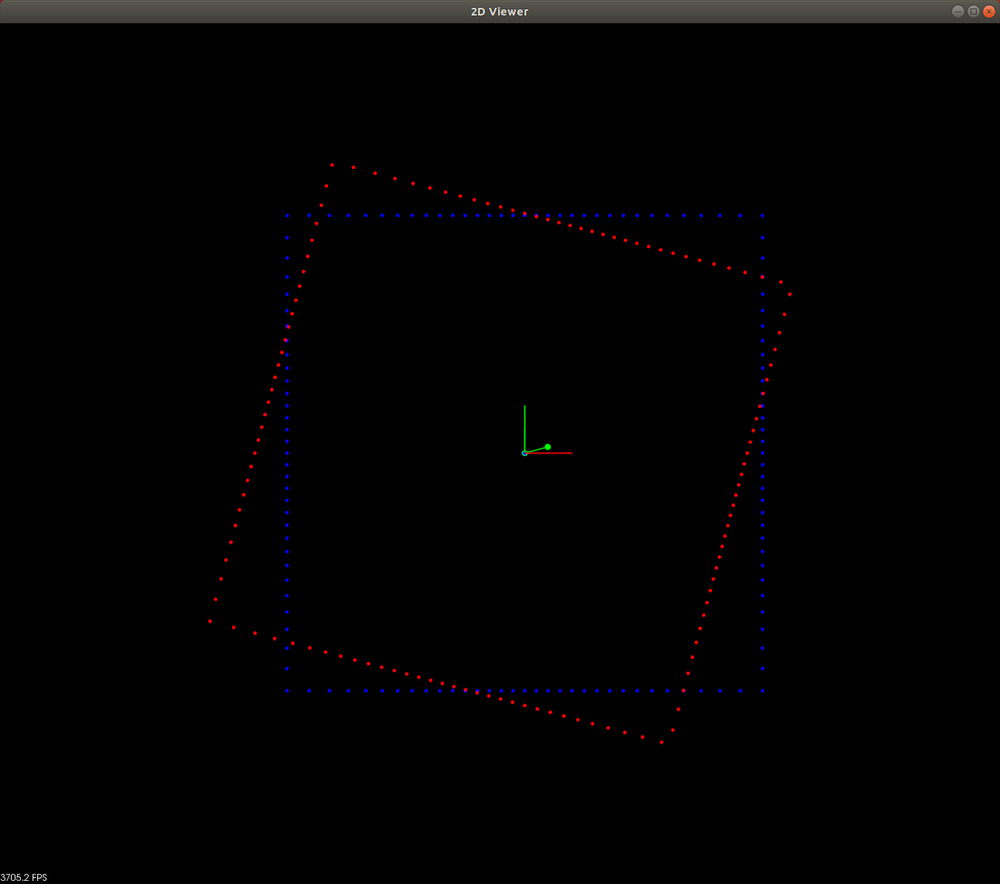
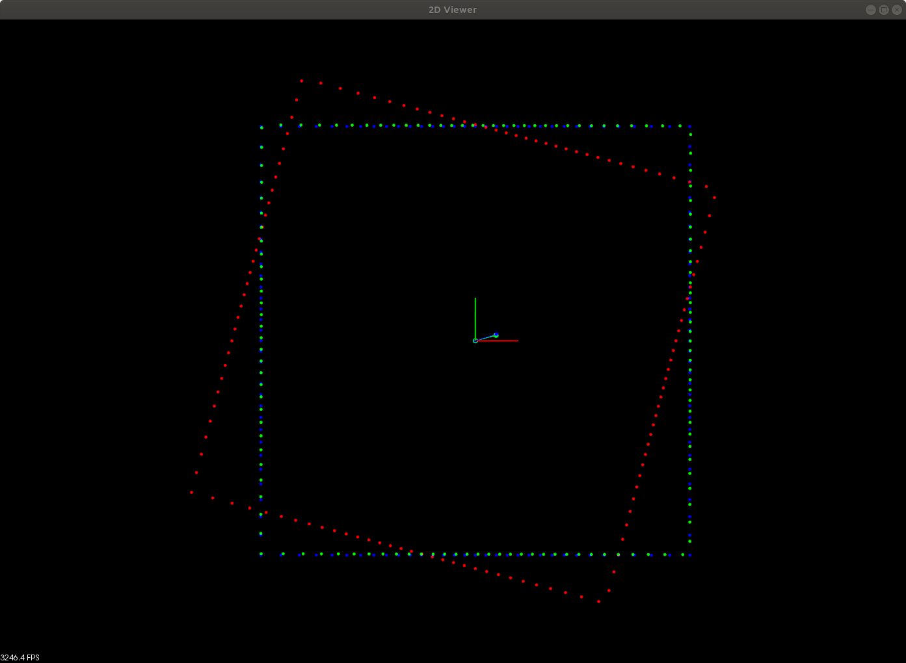
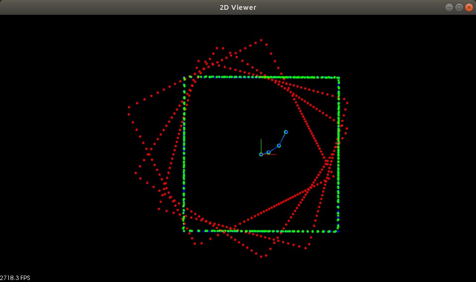
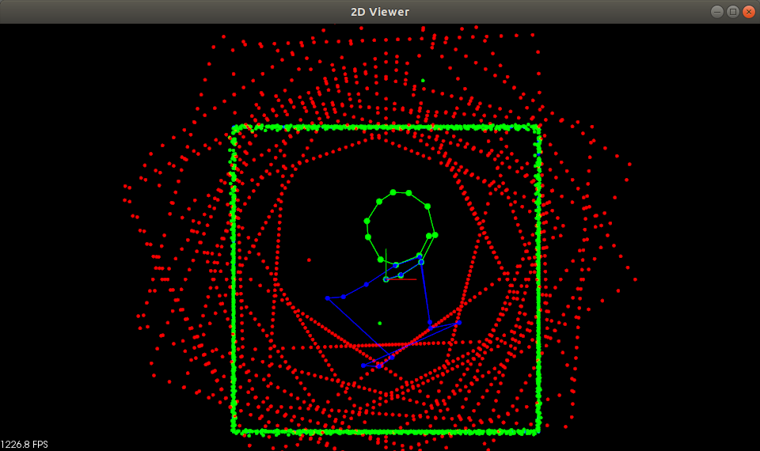
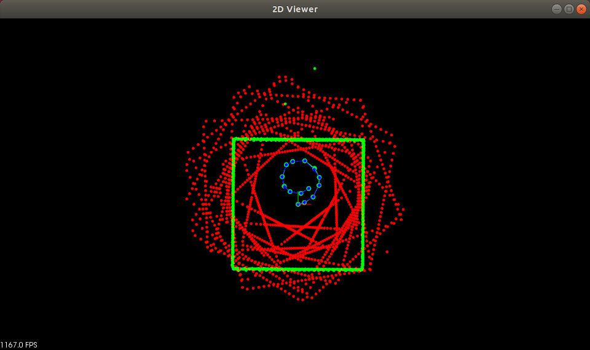

# Exercise: Intro to ICP

Complete the TODO's in `icp1-main.cpp` as detailed on the previous page.

## How to compile:

** Make Sure GPU Is Enabled**

from `/home/workspace `:

`cmake .`

`make`

## How to run:
`./icp`

Note that any visualizations will appear only the remote desktop; if you work in the workspace IDE you will need to click on the "Desktop" button in the bottom right, and only run the executable from the terminal within the remote desktop to view them.

## Description

In this this exercise you will be using ICP to recover the path taken by robot traveling around a room that is only equipped with a single lidar sensor.

The first scan that the robot took from the center is in `blue (target)`. The robot then moves from the center shown by the green line segment and takes a second scan shown in `red (source)`.



*In this exercise everything will as simplified as possible, so the environment will be in 2D, that means the lidar is also scanning 2D point clouds. Below is what it looks like after the robot starting from the center of the room takes one move and scans the environment.*

The end result is shown below with the green scan showing the red scan corrected by the transform from ICP, and now aligning well with the blue scan.



The `blue points and lines (estimated pose)` show the recovered position of the robot from the ICP transform, notice that it's very close with the `ground truth (green points and lines)`.

```
estimated pose (blue): locator
ground truth pose (green): poses
```

### Condition: Part 2 and 3

This is where you can see `the initial pose is very important for ICP to converge`. If the starting pose used was always the robot's initial pose from the middle of the room then ICP will fail to converge at the last step. So the starting pose always needs to be close to the actual position in order for ICP to work well.

Part 2 will have the robot move 2 more steps



Part 3 the robot will complete a full rotation around the room with random movements.

1. Starting pose is always the initial robot position. Contains incorrect ICP convergence estimates.

    

2. ICP uses last estimated position each time as the starting pose.

    
